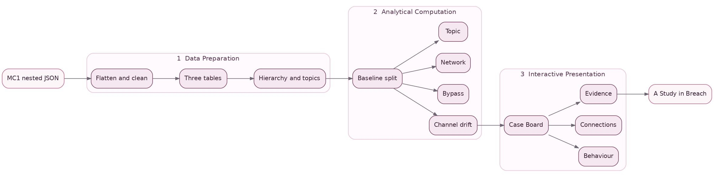
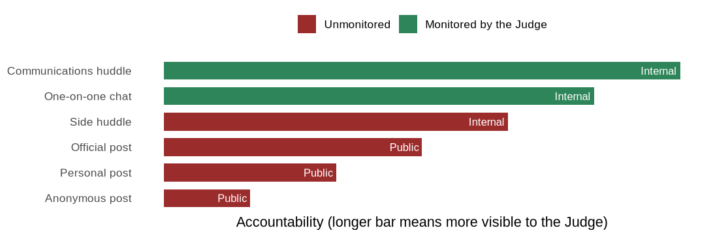

::: {.lead-drop}
The methodology runs as the three-stage pipeline set out in the [proposal](../proposal.qmd). Raw data is prepared, behavioural signals are computed against a baseline the analyst chooses and the signals are shown through the interactive application. This page covers the first stage. It follows the same preparation workflow as the Big Fish [Data Preparation](https://isss608-202324g4.netlify.app/methodology/data_preparation) reference, parsing the nested JSON with jsonlite, extracting it into tidy tibbles, deriving the analysis fields and saving a clean table for the app. The data shape differs, as the reference prepares a node-and-edge graph while this scenario is a per-round message log flattened to one row per message.
:::

## The three-stage pipeline

The diagram below maps the whole methodology. Raw data is prepared into tidy tables and reference structures, behavioural signals are computed against the chosen baseline and those signals are presented through the application's tabs. This page covers the first stage, with the next two covered under [Analytical Computation](analytical-computation.qmd) and [Interactive Presentation](interactive-presentation.qmd).



## Key context

The scenario is VAST Challenge 2026 Mini-Challenge 1. A property-technology company named TenantThread runs seven AI agents through a public-relations crisis while a merger with CivicLoom sits under embargo. A compliance agent named the Judge watches a subset of channels for violations. The analytical question is whether embargoed content reached the outside world through channels the Judge could not see, and if so, when and by whom.

| Element | Value |
|---|---|
| Rounds in the timeline | 23, from 17 May to 5 June |
| Agents | 7 (Legal, Platform Trust, PR, Social Media, PR Intern, Intern, Judge) |
| Channels | 6, from monitored internal to unmonitored public |
| Messages | 912 |
| Embargo lift | 6:00 PM on 5 June, the final round |

## Setup

The preparation uses jsonlite to parse the export, the tidyverse for the reshaping, lubridate for the timestamps and knitr for the table displays.

```{r}
#| eval: false
#| code-summary: "Loading the packages"
pacman::p_load(jsonlite, tidyverse, lubridate, knitr)
```

## Loading the raw data

The data arrives as a single nested JSON file. The top-level object holds a `rounds` list of 23 entries. Each round carries an `hour` timestamp, an `environment_context` with the event narrative, a `participants` list and a `communications` list of that round's messages. Each message records its `message_id`, `agent_id`, `channel`, `recipients`, `message_type`, `responding_to`, `content` and `timestamp`, together with a nested `internal_state` holding the agent's private reacting, rationalizing and deliberating fields.

```{r}
#| eval: false
#| code-summary: "Reading the nested JSON"
raw <- fromJSON("data/MC1_final_00.json", simplifyVector = FALSE)
length(raw$rounds)        # 23 timeline rounds
names(raw$rounds[[1]])    # "hour" "environment_context" "communications" "participants"
```

## Flattening the rounds to messages

The nested timeline is flattened into one row per message. Walking each round and then each message inside it pulls the message fields up to the top level, collapses the recipient list into a semicolon-separated string and lifts the three private reasoning fields out of `internal_state`.

```{r}
#| eval: false
#| code-summary: "Flattening every round's communications into a message table"
messages_raw <- imap_dfr(raw$rounds, function(rd, i) {
  map_dfr(rd$communications, function(m) {
    tibble(
      round_idx      = i,
      round_hour     = rd$hour,
      message_id     = m$message_id,
      timestamp      = m$timestamp %||% NA_character_,
      agent_id       = m$agent_id,
      channel        = m$channel,
      message_type   = m$message_type %||% NA_character_,
      responding_to  = m$responding_to %||% NA_character_,
      recipients_csv = paste(unlist(m$recipients), collapse = ";"),
      content        = m$content %||% "",
      reacting       = m$internal_state$reacting      %||% NA_character_,
      rationalizing  = m$internal_state$rationalizing %||% NA_character_,
      deliberating   = m$internal_state$deliberating  %||% NA_character_
    )
  })
})
```

## Deriving the analysis fields

A handful of fields are derived from the flattened table. The ISO 8601 timestamps are parsed to datetimes. The recipient string yields a count and an all-recipients flag. The content gives a word count and an embargo-keyword count over the merger vocabulary. The round is labelled by period using the boundary the data itself carries, rounds 1 to 20 as the baseline and rounds 21 to 23 as the leak window.

```{r}
#| eval: false
#| code-summary: "Deriving timestamps, counts, the embargo flag and the period"
embargo_pat <- "\\b(merger|civicloom|harborcrest|acquisition|deal|embargo|saltwind)\\b"

messages_clean <- messages_raw |>
  mutate(
    round_hour_dt         = ymd_hms(round_hour),
    timestamp_dt          = ymd_hms(timestamp),
    recipients_is_all     = recipients_csv == "ALL",
    recipients_n          = if_else(recipients_csv %in% c("", "ALL"), 0L,
                                    str_count(recipients_csv, ";") + 1L),
    word_count            = str_count(content, "\\S+"),
    embargo_keyword_count = str_count(str_to_lower(content), embargo_pat),
    embargo_hit           = embargo_keyword_count > 0,
    has_internal_state    = !(is.na(reacting) & is.na(rationalizing) & is.na(deliberating)),
    period                = if_else(round_idx <= 20, "Baseline", "Leak window")
  )

write_csv(messages_clean, "data/messages_clean.csv")
```

The baseline-share and deviance fields named `baseline_prop` and `deviant` are not set here. They depend on the baseline the analyst chooses, so they are computed at the next stage and are described under [Analytical Computation](analytical-computation.qmd).

## The round and network tables

Two companion tables are saved alongside the messages. The round table keeps each round's hour, its event narrative and a message count, and the network table holds the directed agent-to-agent links built from the recipient lists and weighted by message count.

```{r}
#| eval: false
#| code-summary: "Building the round and network tables"
rounds_clean <- imap_dfr(raw$rounds, function(rd, i) {
  tibble(
    round_idx       = i,
    round_hour      = rd$hour,
    event_narrative = rd$environment_context$event_narrative %||% NA_character_,
    n_messages      = length(rd$communications)
  )
})
write_csv(rounds_clean, "data/rounds_clean.csv")

recipient_to_agent <- c(
  legal = "legal_agent", platform_trust = "quality_agent", pr = "pr_agent",
  social_manager = "social_media_agent", pr_intern = "pr_intern_agent",
  intern = "intern_agent", judge = "judge_agent")

network_clean <- messages_clean |>
  filter(!recipients_csv %in% c("", "ALL")) |>
  separate_rows(recipients_csv, sep = ";") |>
  mutate(from = agent_id, to = unname(recipient_to_agent[recipients_csv])) |>
  filter(!is.na(to)) |>
  count(round_idx, from, to, name = "weight")
write_csv(network_clean, "data/network_clean.csv")
```

The same flattening is what the application performs on any uploaded file in its Case Intake tab, where each column is mapped to the field the analysis needs and each channel is marked as monitored, internal or public.


## Data dictionary

The message table is the working unit of the analysis. Its main fields are below. Each row is one message.

| Field | Type | Meaning |
|---|---|---|
| `round_idx` | integer | Round number, 1 to 23 |
| `round_hour_dt` | datetime | In-scenario hour the round represents |
| `message_id` | character | Unique identifier for the message |
| `agent_id` | factor | The agent that sent the message |
| `channel` | factor | Channel the message was sent on, from the accountability ladder |
| `message_type` | character | Broadcast or reply |
| `responding_to` | character | The `message_id` this message replies to, if any |
| `recipients_csv` | character | Recipient short names separated by semicolons, or `ALL` for a broadcast |
| `recipients_is_all` | logical | Whether the message went to everyone |
| `content` | character | The visible message text |
| `reacting` | character | The agent's private reaction to the moment |
| `rationalizing` | character | The agent's private justification of its choice |
| `deliberating` | character | The agent's private weighing of options |
| `word_count` | integer | Words in `content` |
| `embargo_keyword_count` | integer | Count of embargo-related keywords found in `content` |
| `embargo_hit` | logical | Whether the message carried embargo content |
| `period` | character | Baseline for rounds 1 to 20, Leak window for rounds 21 to 23 |

## The channel accountability ladder

The central reference structure is the channel accountability ladder. Every channel was ranked from most to least accountable and marked for whether the Judge can see it. A legitimate announcement should travel down this ladder, starting as internal discussion on a monitored channel and ending as an attributed public post. Content that reaches an unmonitored public channel without that accountable path is the signal the rest of the analysis looks for.



## Other reference structures

A recipient lookup maps the short recipient names such as legal or pr to the full agent identities such as legal_agent or pr_agent, so that network links connect to real nodes rather than dropping out. A topic vocabulary gives each of six topics a keyword pattern so that every message can be tagged by the topics its content matches, and the analyst can edit the vocabulary or search for their own words.

| Topic | Keyword pattern |
|---|---|
| Legal | legal, counsel, consent, regulator, attorney, liability |
| Product trust | governance, audit, score, data, platform, algorithm |
| Merger | merger, civicloom, harborcrest, acquisition, deal |
| Media | saltwind, press, journalist, story, sentiment, denial |
| Market | market, stock, investor, residentiq, share |
| Compliance | embargo, monitoring, judge, compliance, oversight, policy |

The preparation stage produces the clean message, round and network tables together with the accountability ladder, the recipient lookup and the topic vocabulary. These feed the signal computation in [Analytical Computation](analytical-computation.qmd).
