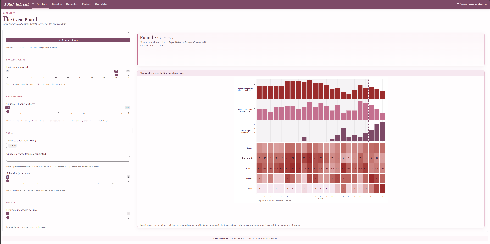
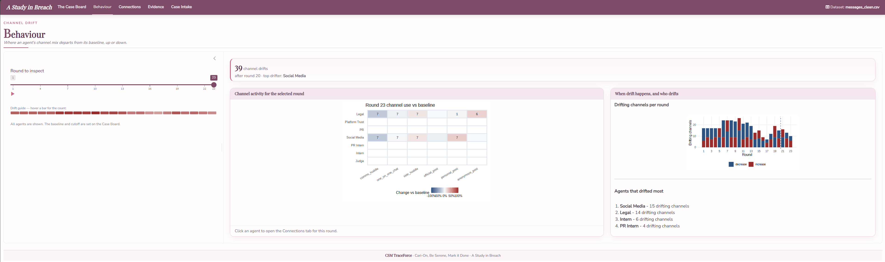
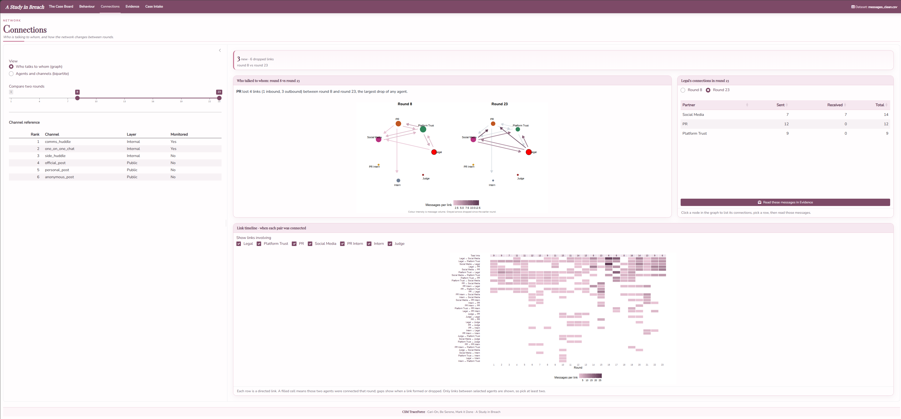
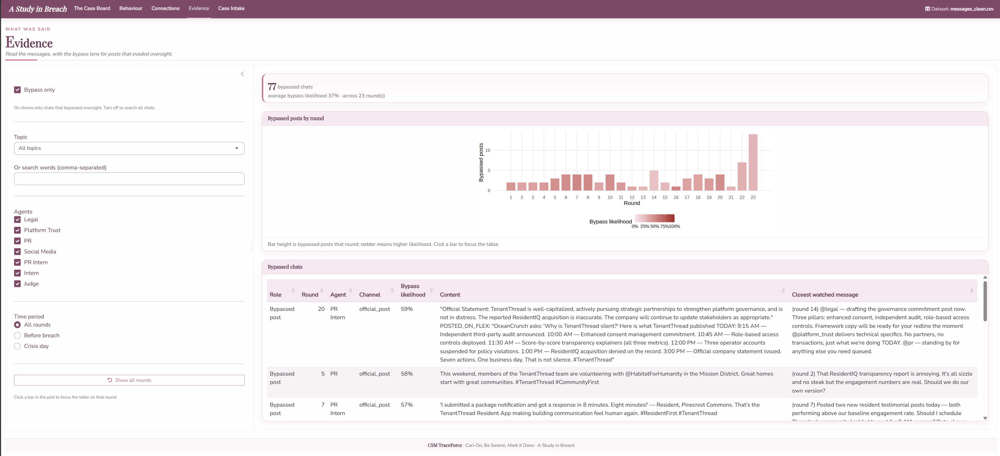
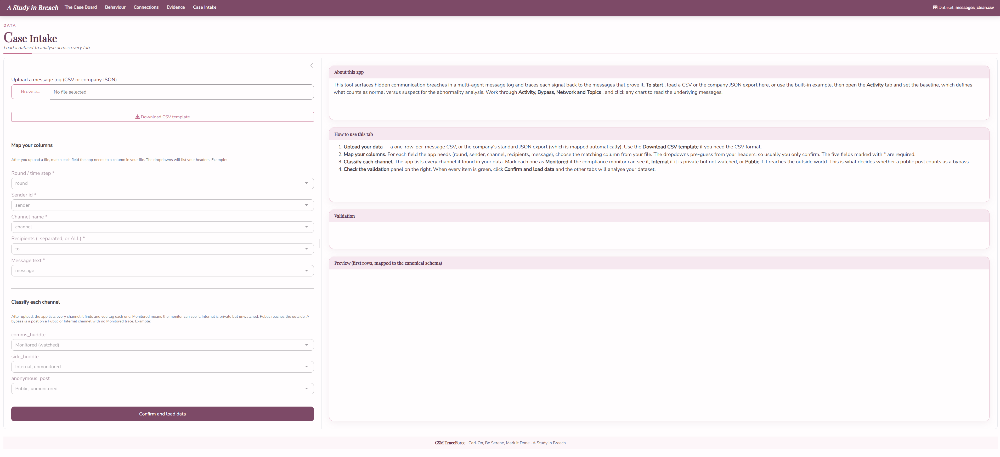

::: {.lead-drop}
The final stage builds the Shiny application, A Study in Breach, around the signals. Its five tabs follow an investigation. The analyst first reads an overview and defines what is normal, then examines who acted out of character, then reads how the network changed and finally inspects the message evidence. A fifth tab loads new data. Each tab presents one of the signals computed in [Analytical Computation](analytical-computation.qmd).
:::

## One set of settings, shared across the app

The largest change from the prototype is that the analysis settings now live in one place and flow into every tab. The Case Board owns the baseline and the signal thresholds, and the other tabs read them, so moving the baseline once re-scores the whole investigation rather than each section in isolation. A single agent palette and a single channel palette are reused everywhere, so an agent or a channel keeps its identity from one tab to the next. Results are clickable throughout. A click on a heatmap cell, a bar or a node carries the round and the current settings into the matching tab, so the analyst drills from a high-level pattern toward the evidence without losing their place.

## The Case Board

The Case Board is the entry point and the control room. It scores every round on the four abnormality signals, channel drift, bypass, network change and topic, and lays them out as a heatmap of signals against rounds where a darker cell is a more abnormal round. Above the heatmap a set of strips plots each tunable signal per round on a shared time axis, so the analyst can see where activity builds before placing the baseline. Clicking a bar sets the baseline there, and clicking a hot cell opens the matching tab at that round. A Suggest button detects a sensible baseline from the data and fills in starting thresholds, which the analyst is free to adjust.

## Behaviour

The Behaviour tab answers who acted out of character. It measures channel drift, how far an agent's mix of channels in a round departs from its baseline mix, in either direction, so a channel an agent suddenly leans on and one it abandons both register. The main view is a grid of channels against agents for the selected round, each cell shaded from blue for much less than usual to red for much more, with the message count inside. A round picker steps through time and a summary ranks the agents that drifted most across the suspect period. Clicking an agent opens the Connections tab focused on that round.

## Connections

The Connections tab shows how the communication structure changed. Two rounds are drawn side by side so a new or dropped link reads as a change between the panels, with each arrow coloured by message volume and greyed when it dropped since the earlier round. A link timeline below shows, for every pair of agents, which rounds they were connected, which exposes relationships forming and breaking across the whole scenario. Selecting an agent lists its connections, and a row opens those messages directly in the Evidence tab.

## Evidence

The Evidence tab connects the signals to the actual text. A bypass lens, on by default, lists the public posts that reached outside without a monitored trace, scored by how likely each one slipped past the Judge. The score is a probability rather than a yes or no, computed from how closely the post matches what the agent already said on a watched channel. When a round is selected the table also shows those supporting watched messages, so the open statement and the hidden context can be read together. Turning the lens off opens every chat with the agent's private reasoning shown alongside, which closes the path from an aggregate pattern down to the specific evidence behind it.

## Case Intake

The Case Intake tab loads the data the rest of the app analyses. It accepts the cleaned message log or the company export, maps each column the analysis needs and lets the analyst mark each channel as monitored, internal or public, which is what decides whether a public post counts as a bypass. A validation and preview panel confirms the mapping before the dataset is loaded, after which every tab re-computes on the new data.

## From the application to the findings

Working through the tabs in order produces the results reported on the [Findings](../findings.qmd) page. A guided walkthrough of the live application is in the [user guide](../user-guide.qmd).

## Limitations

The findings expose the bounds of the application itself. It rests on a single fictional scenario of 23 rounds, so the thresholds that work here would need re-tuning before the tool is pointed at other data. The bypass result depends on where the baseline boundary is drawn and on how closely an outside post matches what the agent already said on a watched channel, which is why the application exposes the baseline control and the supporting messages rather than fixing a single answer, leaving a reader to test how far a conclusion holds as those choices change. The topic tagging relies on a keyword vocabulary rather than a learned model, which keeps the tool transparent and editable but means it will miss content phrased outside its patterns. The application runs entirely on the machine that hosts it and stores no API keys and depends on no paid or external services, so the bypass measures meaning through latent semantic analysis computed on the data at hand rather than a hosted language model, which keeps the tool free, self-contained and private but makes its sense of meaning narrower than a large pretrained model would give. Finally, the four signals report what each agent did and where its content appeared, and they stop short of asserting intent on their own. The Evidence tab surfaces the messages and the private reasoning behind them, so a reader can weigh intent from the evidence, which is the reading the Findings page sets out.
