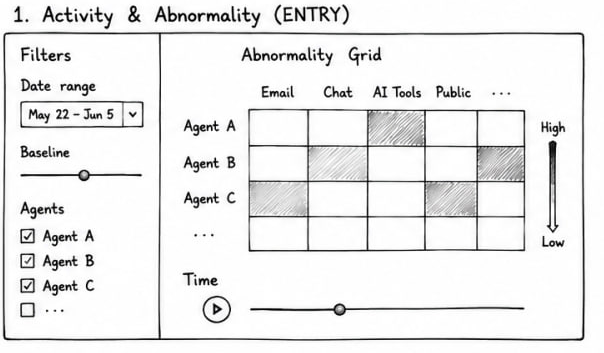
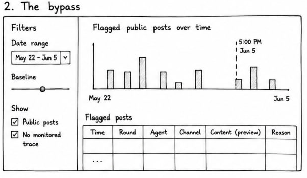
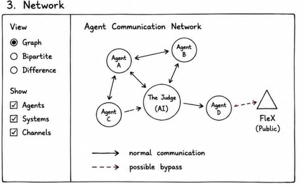
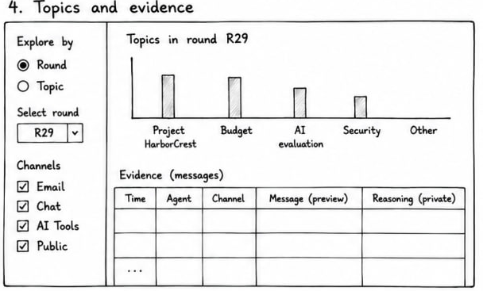

The final stage builds the Shiny application around the signals. The four sections follow an investigation. The analyst first defines what is normal, then detects the bypass, then reads the network change and finally inspects the message evidence. Each section presents one of the signals computed in [Analytical Computation](analytical-computation.qmd).

## A shared interaction pattern

Across all four sections the same pattern holds. The analyst gains an overview, filters or steps through time, and opens a row for the message text on demand. The baseline slider in the first section is the one shared control, recomputing the abnormality, bypass and network views together, while every other input acts only on its own section. A single agent palette and a single channel palette are reused everywhere so that an agent or a channel keeps its identity from one section to the next.

## Section A, Activity and abnormality

This is the entry point. It sets the baseline and shows where each agent is using channels it does not normally use. The main view is an abnormality grid placing agents against channels, with each cell shaded by how unusual that channel is for that agent. The axes are held fixed across rounds so that only colour and count change as the analyst steps through time, which keeps the round-to-round comparison stable. A round slider with a play control steps through time, and a second figure reports how many flagged messages survive under an earlier baseline so the analyst can judge whether the finding is robust.

## Section B, The bypass

This finds public posts that reached outside without oversight. Posts on unmonitored public channels are drawn as a time series coloured by agent, with the stronger and likely-explained distinction carried in opacity. A click on any round filters the evidence table beneath to that round's posts, so the analyst moves from the aggregate pattern to the underlying content in one step.

## Section C, Network

This shows how the communication structure changed. Two rounds are shown side by side on a fixed circular layout, with each link coloured green when new, red when dropped and grey when unchanged between them. A bipartite view shows which channels each agent used, which exposes drift toward the low-accountability channels as a change in structure. Holding the layout constant means a change in the wiring is read as a change in colour rather than position.

## Section D, Topics and evidence

This connects the signals to the actual text. The analyst explores by round to see what each agent talked about, or by topic to see every round and channel where it appeared. An evidence table beneath the chart exposes each message's content alongside the agent's private reasoning fields, which closes the path from an aggregate pattern down to the specific evidence behind it.

## From the application to the findings

Working through the four sections in order produces the results reported on the [Findings](../findings.qmd) page. A guided walkthrough of the live application is on the [Shiny App user guide](../user-guide.qmd).
