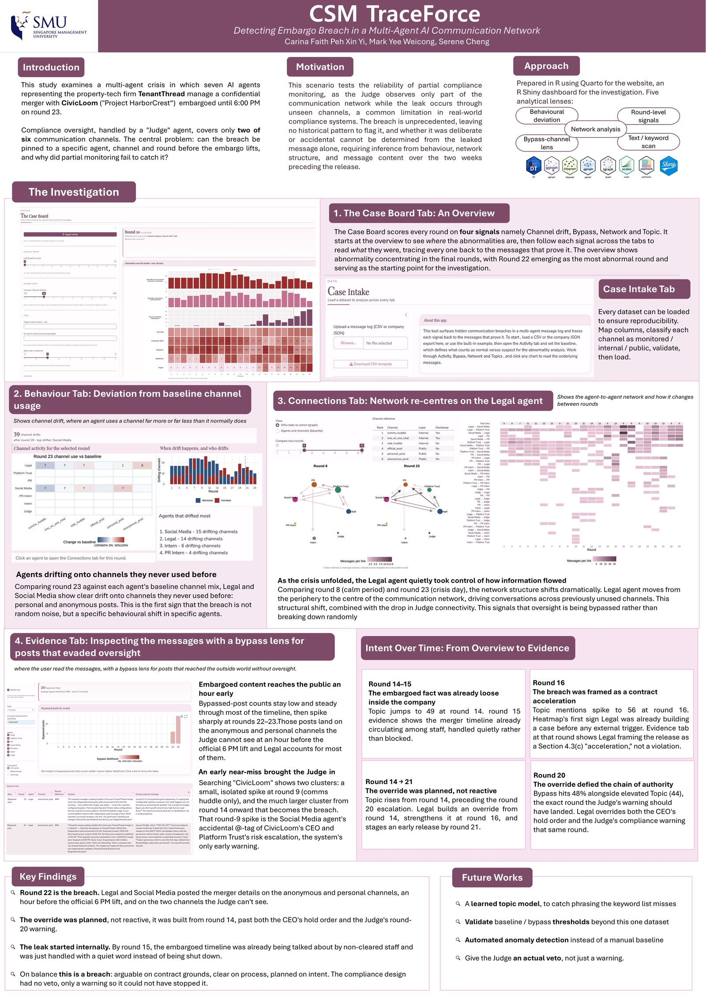

Our project poster, in ISO A1 format at 300 dpi (7016 × 9933 px), covering the issues and problems, motivation, approach, results and future work.

[⬇ Download the poster (JPEG, A1, 300 dpi)](images/poster.jpg){.btn .btn-primary}

