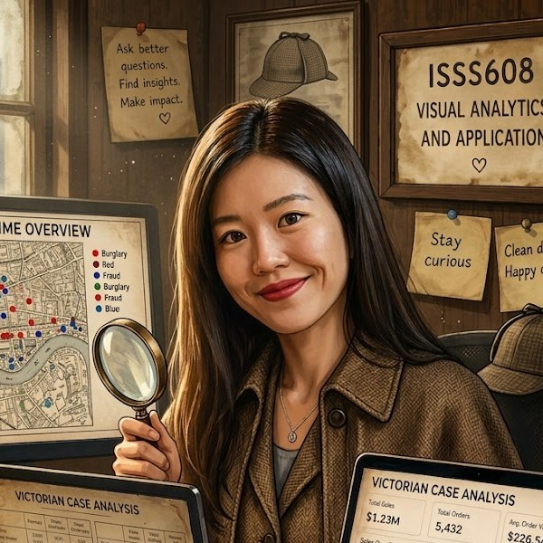
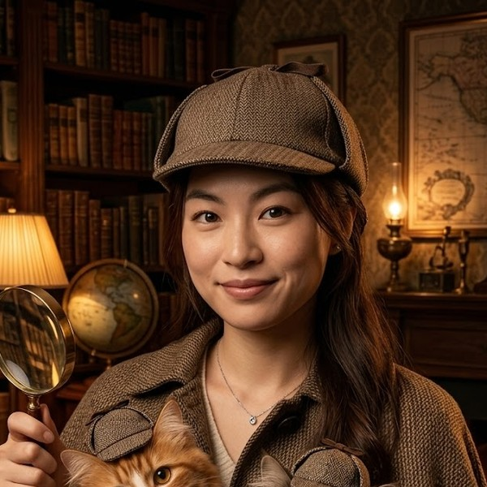

Three analysts, two cats and one embargo that did not stand a chance. We built the visual analytics tool that follows the signals back to the messages that prove them.

::: {.team-grid}

::: {.member-card}

Mark Yee

Lead Investigator

Keeper of the deerstalker and the master plan. Pins channels to the board, mutters "follow the messages" at the screen, and stops the cat from sitting on the keyboard mid-render.
:::

::: {.member-card}

Serene Cheng

The Judge

The calm at the centre of the storm. While the embargo leaks and the agents lose their heads, she quietly decides what actually counts as a breach. The gavel is mostly decorative.
:::

::: {.member-card}

Carina Faith Peh

Forensic Analyst

Reads the evidence and the agents' private thoughts with equal delight. No keyword slips past her across the rounds, and she insists the whole thing stays tidy while she is at it.
:::

:::

## Project contributions

| Member | Contribution |
|---|---|
| Mark Yee | Project direction, proposal and website, activity and breach views |
| Serene Cheng | Topic selection and the network analysis |
| Carina Faith Peh | Topic and evidence analysis, and user experience |
